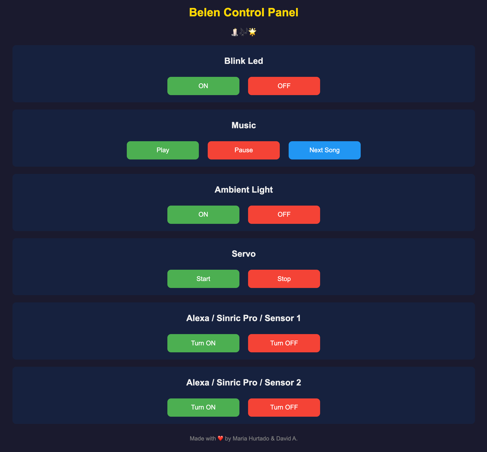

# Belen - ESP32 Christmas Nativity Controller

A smart Christmas nativity scene controller built with ESP32, featuring LED lights, music, servo motor animation, RGB ambient lighting, and Alexa integration via Sinric Pro.

## Screenshots

<p align="center">

</p>

## Features

- **Status LED**: Blinking LED indicator
- **Christmas Music**: Plays classic Christmas carols (Silent Night, Joy to the World, Jingle Bells, Adeste Fideles)
- **Servo Motor**: Animated movement for nativity figures
- **RGB Ambient Light**: Warm yellow breathing effect
- **Web Interface**: Control panel accessible at `http://192.168.1.100`
- **Alexa Integration**: Voice control via Sinric Pro contact sensors

## Hardware Requirements

- ESP32 Development Board
- Piezo Buzzer (GPIO 26)
- Servo Motor (GPIO 14)
- Status LED (GPIO 27)
- RGB LED:
  - Red (GPIO 25)
  - Green (GPIO 32)
  - Blue (GPIO 33)

## Pin Configuration

| Component    | GPIO Pin |
| ------------ | -------- |
| Status LED   | 27       |
| Piezo Buzzer | 26       |
| Servo Motor  | 14       |
| RGB Red      | 25       |
| RGB Green    | 32       |
| RGB Blue     | 33       |

## Software Requirements

- [PlatformIO](https://platformio.org/) (VS Code extension recommended)
- ESP32 Arduino framework

## Dependencies

- `madhephaestus/ESP32Servo@^1.2.1`
- `sinricpro/SinricPro@^3.2.0`

## Installation

1. Clone this repository:

   ```bash
   git clone https://github.com/davidasensio/Belen.git
   cd Belen
   ```

2. Open the project in VS Code with PlatformIO extension

3. Create a `src/credentials.h` file with your credentials (this file is gitignored):

   ```cpp
   #ifndef CREDENTIALS_H
   #define CREDENTIALS_H

   // WiFi credentials
   #define WIFI_SSID     "YOUR_WIFI_SSID"
   #define WIFI_PASSWORD "YOUR_WIFI_PASSWORD"

   // Sinric Pro credentials (from https://sinric.pro)
   #define SINRIC_APP_KEY      "your-app-key"
   #define SINRIC_APP_SECRET   "your-app-secret"
   #define SINRIC_DEVICE_ID_1  "your-device-id-1"
   #define SINRIC_DEVICE_ID_2  "your-device-id-2"

   #endif
   ```

4. (Optional) Configure static IP in `src/web_server.cpp`:

   ```cpp
   IPAddress staticIP(192, 168, 1, 100);
   IPAddress gateway(192, 168, 1, 1);
   ```

5. Build and upload:
   ```bash
   pio run --target upload
   ```

## Sinric Pro / Alexa Setup

To enable Alexa voice control:

1. Create an account at [sinric.pro](https://sinric.pro)
2. Get your **App Key** and **App Secret** from the Credentials page
3. Create two **Contact Sensor** devices and note their Device IDs
4. Add your Sinric Pro credentials to `src/credentials.h` (already done if you followed step 3 above)
5. In the Alexa app:
   - Go to Skills & Games
   - Search for "Sinric Pro" and enable it
   - Link your Sinric Pro account
   - Discover devices
6. Create Alexa routines triggered by the contact sensors

## Web Interface

Access the control panel at `http://192.168.1.100` (or the IP shown in Serial Monitor).

Available controls:

- **Blink LED**: ON/OFF
- **Music**: Play/Pause/Next Song
- **Ambient Light**: ON/OFF
- **Servo**: Start/Stop
- **Alexa Sensor 1**: Turn ON/OFF
- **Alexa Sensor 2**: Turn ON/OFF

## API Endpoints

| Endpoint           | Description                    |
| ------------------ | ------------------------------ |
| `GET /`            | Web control panel              |
| `GET /led/on`      | Enable LED blinking            |
| `GET /led/off`     | Disable LED                    |
| `GET /music/on`    | Resume music                   |
| `GET /music/off`   | Pause music                    |
| `GET /music/next`  | Next random song               |
| `GET /ambient/on`  | Enable ambient light           |
| `GET /ambient/off` | Disable ambient light          |
| `GET /servo/on`    | Start servo animation          |
| `GET /servo/off`   | Stop servo                     |
| `GET /alexa/on`    | Trigger Alexa sensor 1 (open)  |
| `GET /alexa/off`   | Trigger Alexa sensor 1 (close) |
| `GET /alexa2/on`   | Trigger Alexa sensor 2 (open)  |
| `GET /alexa2/off`  | Trigger Alexa sensor 2 (close) |

## Project Structure

```
Belen/
├── src/
│   ├── belen_esp32.ino      # Main program
│   ├── credentials.h        # Your credentials (gitignored, create this file)
│   ├── web_server.cpp       # Web server & WiFi setup
│   ├── web_server.h         # Web server header
│   ├── sinric_pro.cpp       # Sinric Pro / Alexa integration
│   ├── sinric_pro.h         # Sinric Pro header
│   └── songs/               # Christmas carol definitions
│       ├── notes.h
│       ├── silent_night.h
│       ├── joy_to_the_world.h
│       ├── jingle_bells.h
│       └── adeste_fideles.h
├── .gitignore               # Git ignore file
├── platformio.ini           # PlatformIO configuration
└── README.md
```

## Authors

Made with ❤️ love by Maria Hurtado & David A.

## License

This project is open source and available under the [MIT License](LICENSE).
